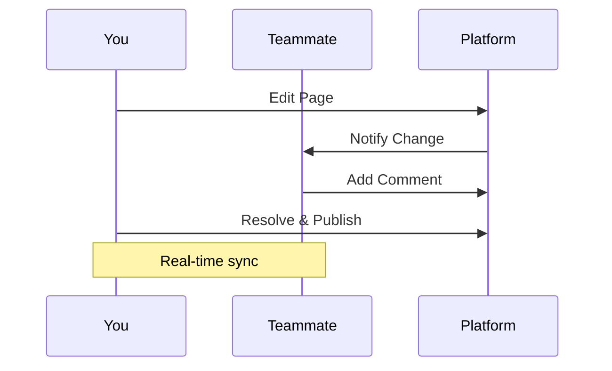

## Overview

You manage all your project documentation in ดีเจ Dinning's platform. Organize pages into sections, add rich multimedia, track changes with version control, and collaborate seamlessly with your team. Follow these guides to structure your docs effectively.

<Columns cols={3}>
  <Card title="Create Pages" icon="file-plus" href="#">
    Build new documentation pages quickly.
  </Card>
  <Card title="Embed Media" icon="image" href="#">
    Add images, videos, and interactive elements.
  </Card>
  <Card title="Collaborate" icon="users" href="#">
    Work with your team using version history.
  </Card>
</Columns>

## Structuring Pages and Sections

Organize your documentation hierarchically. Create top-level sections and nest pages underneath for intuitive navigation.

<Steps>
  <Step title="Create a Section" icon="folder">
    Navigate to your workspace dashboard.

    Click `New Section` and enter a title like `API Reference`.

    Save to generate a folder-like structure.
  </Step>
  <Step title="Add Pages" icon="file-text">
    Inside the section, select `New Page`.

    Choose `guide.mdx` as the file type for rich content.

    Start editing with the built-in MDX editor.
  </Step>
  <Step title="Reorder Content" icon="move">
    Drag pages in the sidebar to reorder.

    Use `Promote` or `Demote` buttons for nesting levels.
  </Step>
</Steps>

<Callout kind="tip">
  Maintain a clear hierarchy: Use H2 for main sections and H3 for subsections to improve readability.
</Callout>

## Adding Multimedia and Embeds

Enhance your docs with images, videos, and code snippets. The platform supports native MDX components for seamless integration.

<Tabs>
  <Tab title="Images" icon="image">
    Upload assets to your workspace media library.

    Use the `<Image>` component:

````jsx
<Image
  src="https://your-workspace.com/assets/screenshot.png"
  alt="Dashboard overview"
  width="800"
  height="600"
/>
````
  </Tab>
  <Tab title="Videos" icon="video">
    Embed platform videos or external sources.

    Example for self-hosted video:

````jsx
<Video
  src="https://your-workspace.com/videos/tutorial.mp4"
  title="Setup tutorial"
  width="560"
  height="315"
  controls="true"
/>
````
  </Tab>
  <Tab title="Code Examples" icon="code">
    Highlight syntax with code blocks.

    <CodeGroup tabs="JavaScript,Python">
```javascript
async function fetchData(apiKey) {
  const response = await fetch('https://api.example.com/users', {
    headers: { 'Authorization': `Bearer ${apiKey}` }
  });
  return response.json();
}
```
```python
import requests

def fetch_data(api_key):
    response = requests.get(
        'https://api.example.com/users',
        headers={'Authorization': f'Bearer {api_key}'}
    )
    return response.json()
```
    </CodeGroup>
  </Tab>
</Tabs>

## Version Control Basics

Track changes automatically. Every edit creates a new version, allowing you to revert or compare history.

<Expandable title="View Version History" default-open="true">
  Right-click a page in the sidebar and select `Version History`.

  Compare diffs side-by-side.

  Restore any previous version with one click.
</Expandable>

<Callout kind="alert">
  Commit meaningful changes with descriptions like `Fix API endpoint docs` to aid team reviews.
</Callout>

## Collaboration Workflows

Invite team members and assign roles. Use comments, approvals, and real-time editing for smooth teamwork.



<Steps>
  <Step title="Invite Collaborators" icon="user-plus">
    Go to workspace settings.

    Add emails and set permissions: `Editor`, `Viewer`, or `Admin`.
  </Step>
  <Step title="Review Changes" icon="eye">
    Use `@mentions` in comments for quick feedback.

    Approve publishes via pull request-like workflow.
  </Step>
</Steps>

<Expandable title="Advanced Permissions">
  Customize roles:

  | Role    | Edit Pages | Publish | Manage Users |
  |---------|------------|---------|--------------|
  | Viewer  | No         | No      | No           |
  | Editor  | Yes        | No      | No           |
  | Admin   | Yes        | Yes     | Yes          |
</Expandable>