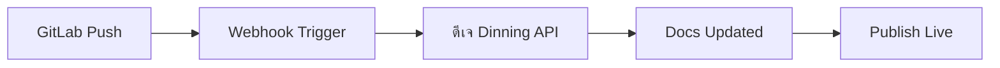

## Overview

Integrate ดีเจ Dinning with your favorite tools to streamline documentation management. You gain access to popular services like GitHub for version control syncing and Slack for notifications. Use the REST API for custom extensions, embed external content seamlessly, and automate workflows with version control systems.

<Columns cols={3}>
  <Card title="GitHub" icon="github" href="https://github.com">
    Sync documentation changes directly with your repositories.
  </Card>
  <Card title="Slack" icon="message-circle" href="https://slack.com">
    Receive real-time notifications on documentation updates.
  </Card>
  <Card title="Custom API" icon="api" href="#api-access">
    Build tailored integrations using our RESTful API endpoints.
  </Card>
</Columns>

## Popular Integrations

Set up integrations quickly to boost productivity. Start with GitHub for automatic syncing or Slack for team alerts.

### GitHub Integration

Connect your GitHub repository to mirror documentation updates.

<Steps>
  <Step title="Create Webhook" icon="hook">
    In your GitHub repo settings, add a webhook pointing to `https://api.djdinning.com/webhooks/github`.
  </Step>
  <Step title="Configure Events" icon="settings">
    Select events like `push` and `pull_request` to trigger syncs.
  </Step>
  <Step title="Add Secret" icon="lock">
    Use `YOUR_WEBHOOK_SECRET` as the secret for security.
  </Step>
</Steps>

<Callout kind="tip">
  Test your webhook with a sample push to ensure events flow to ดีเจ Dinning.
</Callout>

### Slack Notifications

<Tabs>
  <Tab title="Incoming Webhook" icon="arrow-up-circle">
    Create an incoming webhook in Slack and paste the URL into ดีเจ Dinning settings.

    ```bash
    curl -X POST https://hooks.slack.com/services/YOUR/SLACK/WEBHOOK \
      -H 'Content-type: application/json' \
      -d '{
        "text": "New doc published: https://docs.djdinning.com/page"
      }'
    ```
  </Tab>
  <Tab title="Bot User" icon="bot">
    Install the ดีเจ Dinning Slack app and authorize channels for updates.
  </Tab>
</Tabs>

## API Access for Custom Extensions

Access the ดีเจ Dinning API to create bespoke integrations. Authenticate with a bearer token.

<CodeGroup tabs="JavaScript,cURL">
  ```javascript
  const response = await fetch('https://api.djdinning.com/v1/docs', {
    headers: {
      'Authorization': `Bearer ${YOUR_API_TOKEN}`,
      'Content-Type': 'application/json'
    }
  });
  const docs = await response.json();
  console.log(docs);
  ```
  ```bash
  curl -X GET https://api.djdinning.com/v1/docs \
    -H "Authorization: Bearer YOUR_API_TOKEN" \
    -H "Content-Type: application/json"
  ```
</CodeGroup>

<ParamField path="docs/:id" param-type="GET" required="true">
  Retrieve a specific document by ID.
</ParamField>

<ParamField header="Authorization" param-type="string" required="true">
  Bearer token for authentication.
</ParamField>

## Embedding External Content

Embed iframes or widgets from third-party services directly into your docs.

```html
<iframe
  src="https://your-embed-provider.com/widget/123"
  width="100%"
  height="400"
  frameborder="0">
</iframe>
```

## Syncing with Version Control Systems

Automate documentation syncing from Git providers.

<Expandable title="Advanced GitLab Sync" default-open="false">

Configure GitLab webhooks similarly to GitHub.



</Expandable>

<Callout kind="alert">
  Always use HTTPS endpoints and validate payloads to prevent unauthorized access.
</Callout>